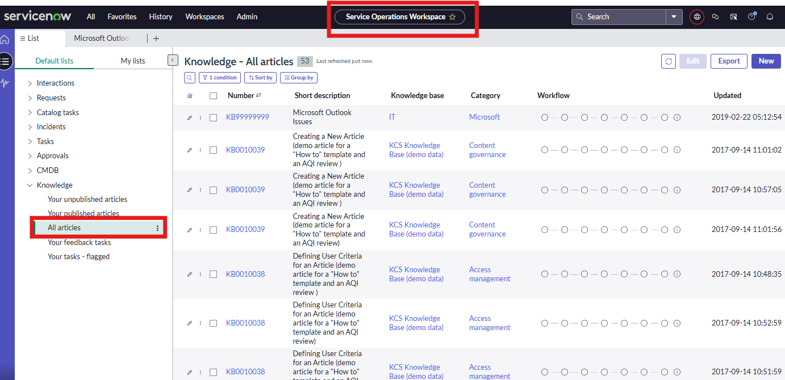
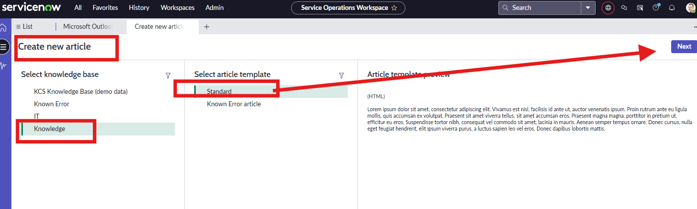
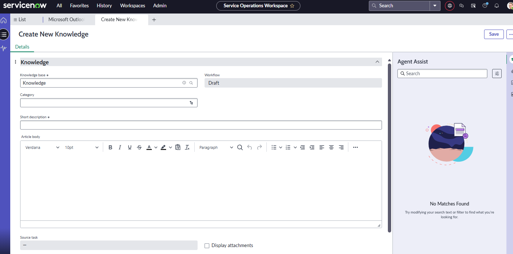
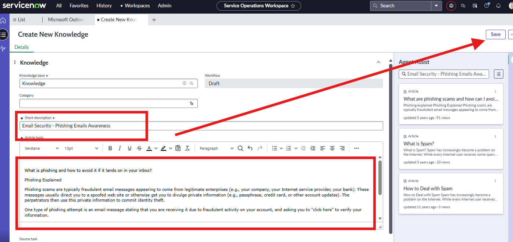
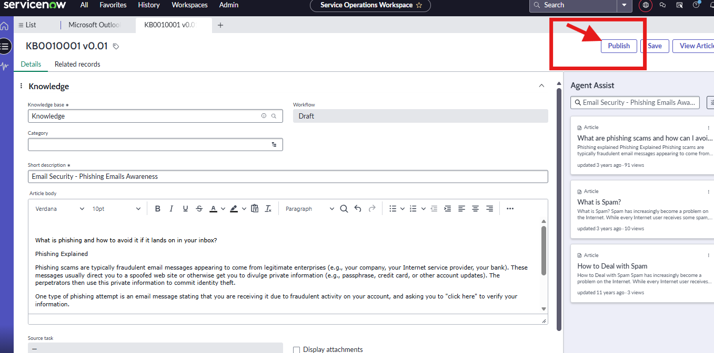
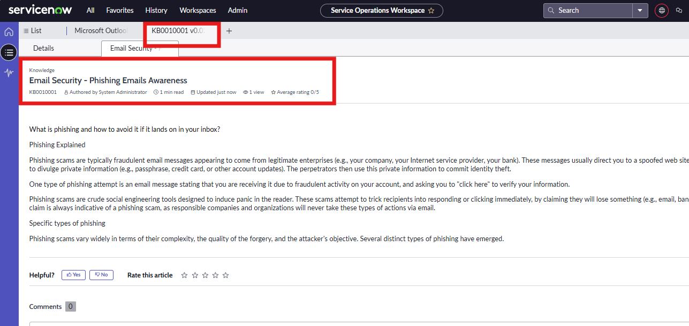
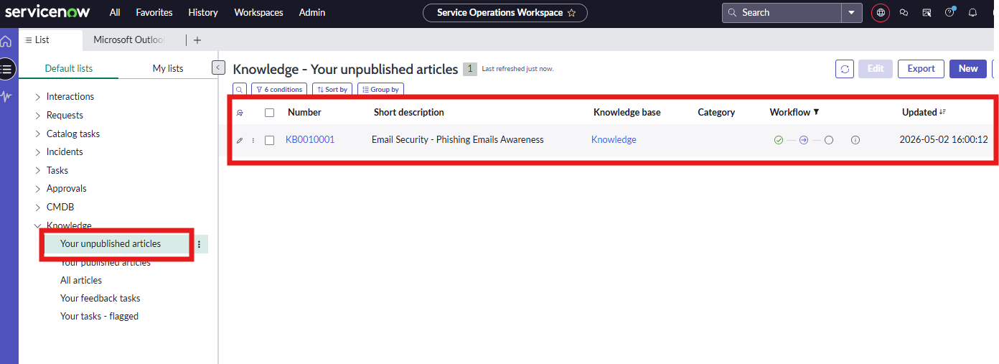

## 💡 In this exercise, I created a knowledge‑base article to be added to the searchable article database for end users. The article focuses on email security and provides guidance on phishing awareness.

