## 💡 In this exercise, I provisioned multiple user accounts within my personal ServiceNow Developer Instance and assigned them to the appropriate Helpdesk assignment group, establishing role‑based access controls and aligning group membership with ITIL‑compliant support tier structures.

### 🛠️ First Step - showcasing the actual personal ServiceNow instance

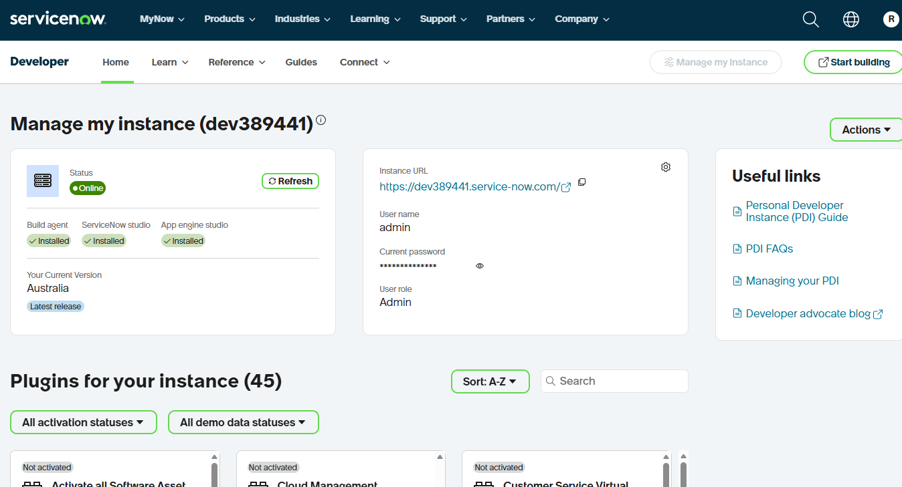

### 🛠️ Current Default Groups

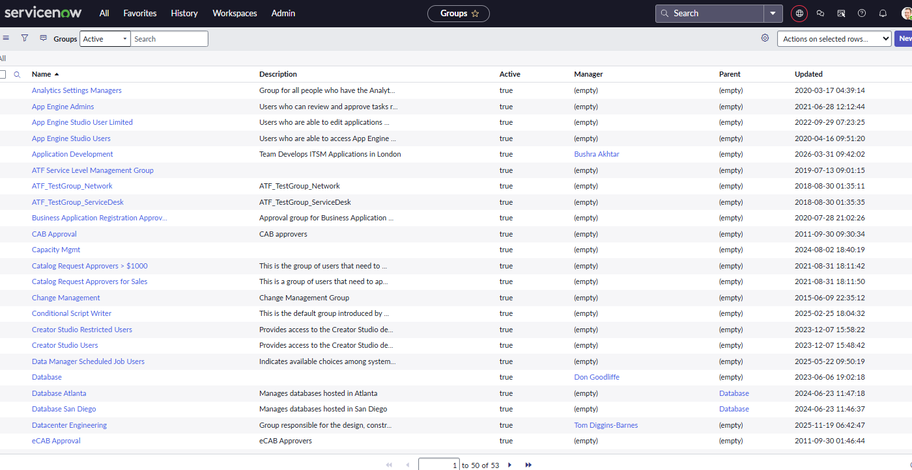

Will be adding new users to the Help Desk group

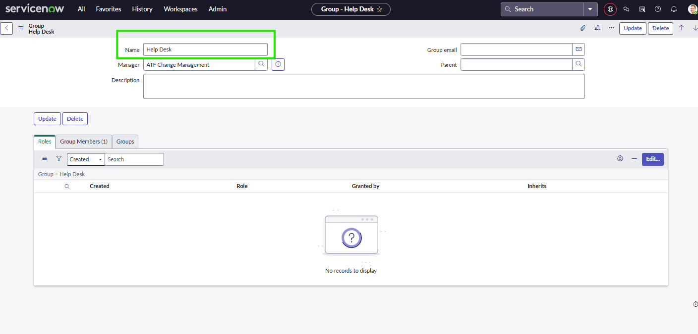

### 🛠️ Go to the left hand menu ALL >>> select USERS administration

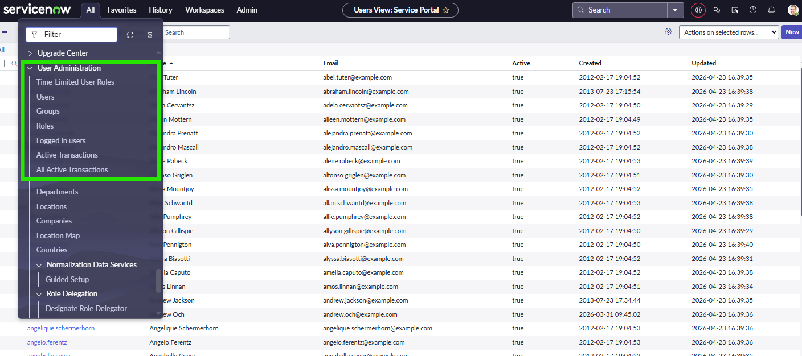

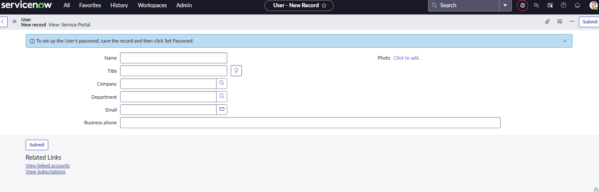

### 🛠️ Add new with fields >>> Bruce Banner 

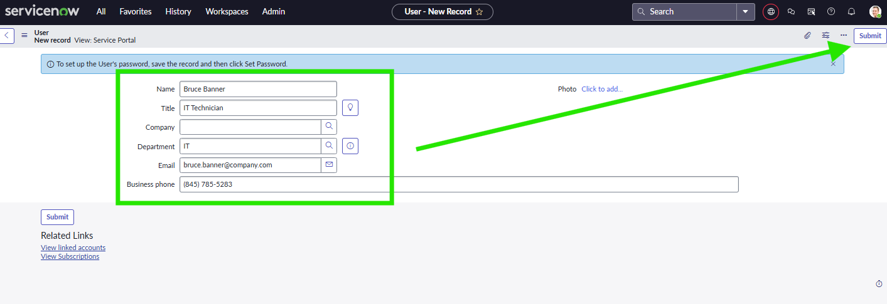

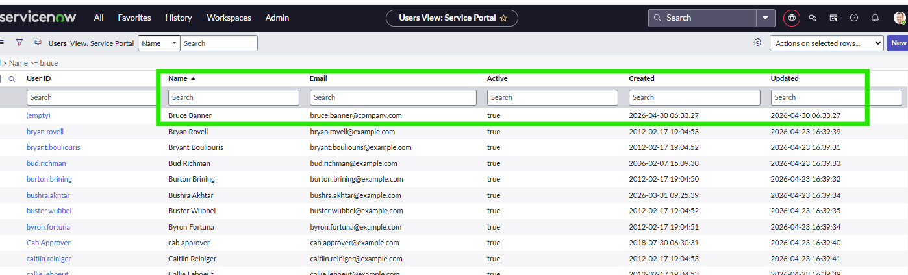

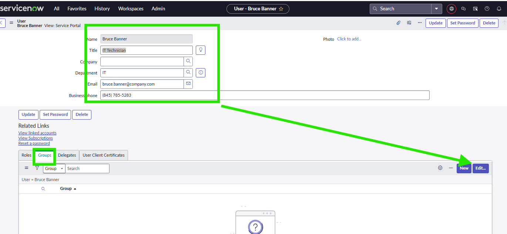

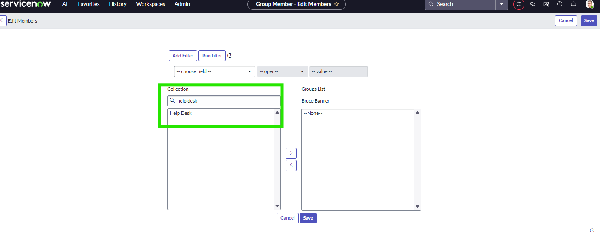

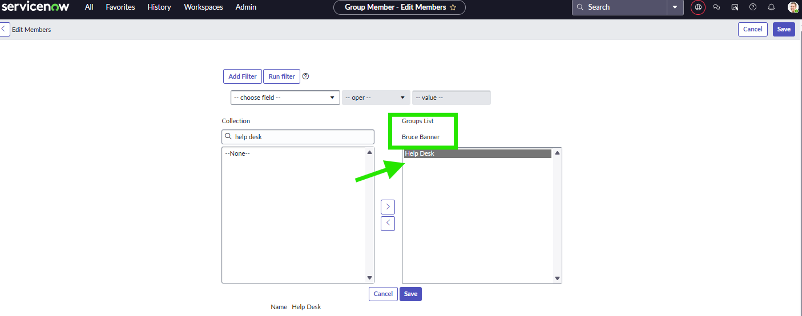

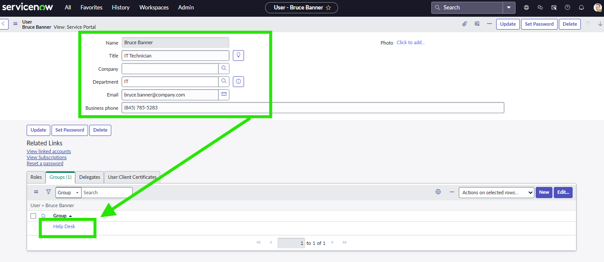

### 🛠️ Adding users to the HELP DESK GROUP

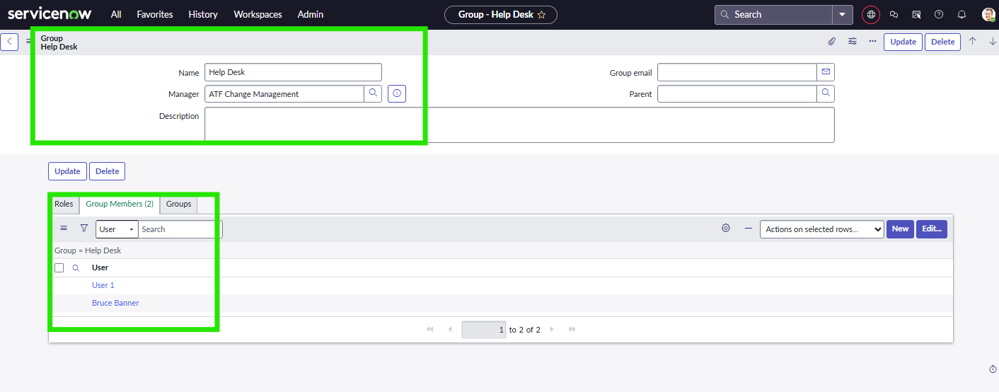

###  🛠️ Verify users to the HELP DESK GROUP - Users created Bruce Banner, Peter Parker, Tony Stark
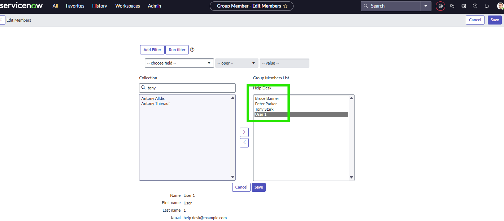

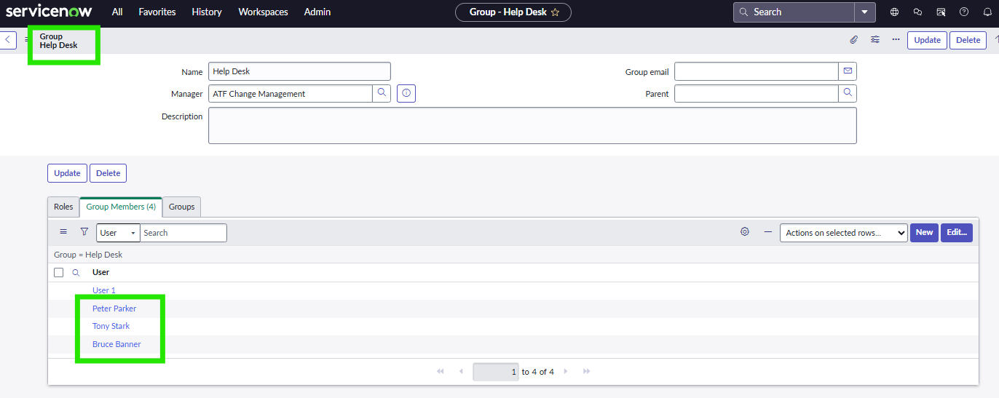

