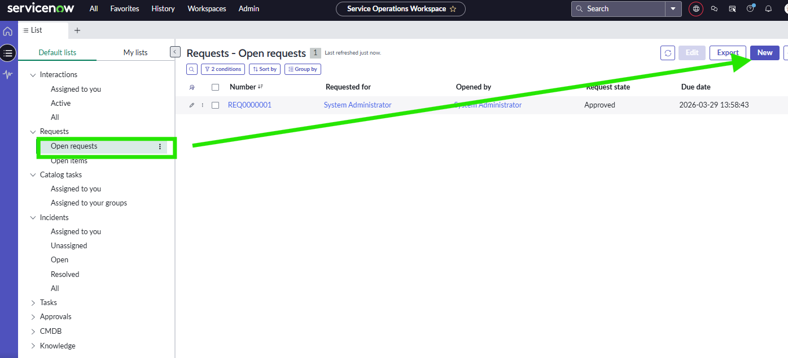
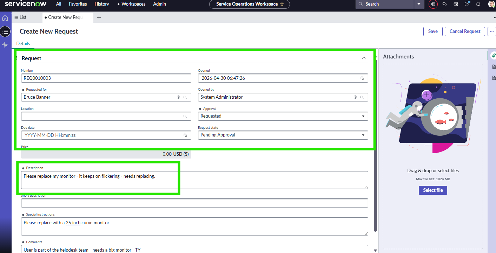
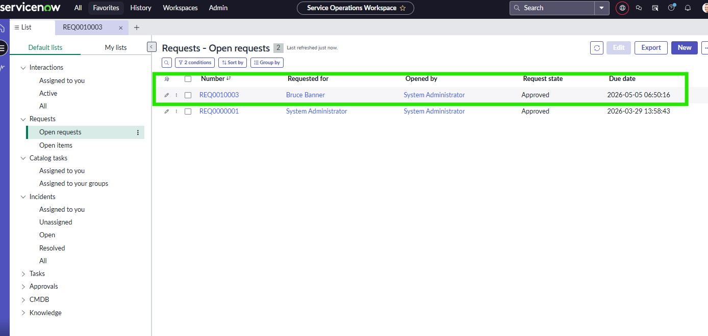

## In this exercise, I initiated an IT resource request, generated a corresponding incident ticket, routed the ticket to the appropriate helpdesk assignment group, and re‑assigned it to a designated technician. I added work notes and escalation updates throughout the ticket lifecycle, then transitioned the ticket through its required states before performing final resolution and closure with full documentation.

### 🛠️ Create an IT Request

### 🛠️ Create an IT ticket and manage ticket flow

### 🛠️ Ticket Resolution

